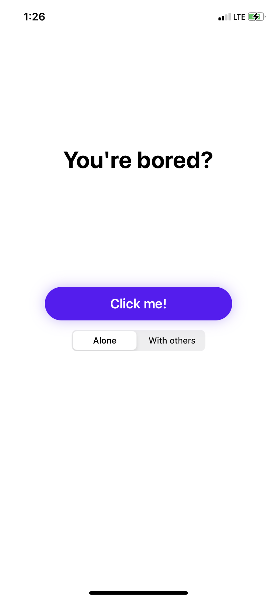
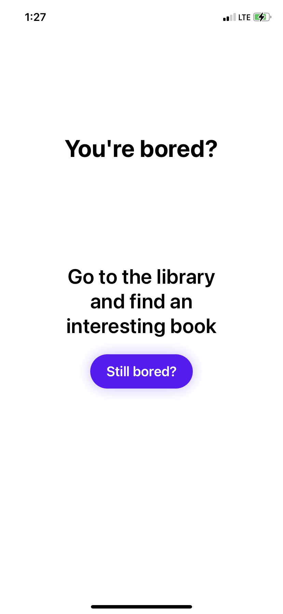
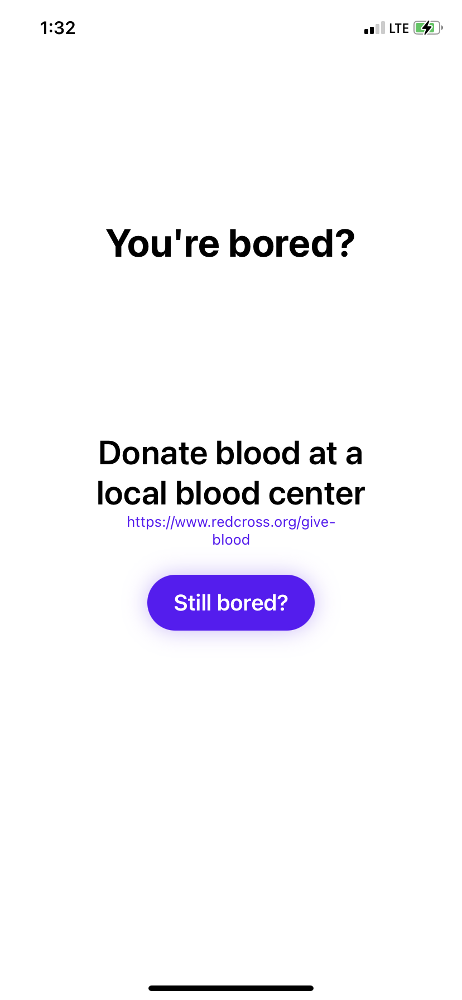

# Bored
Bored is a simple SwiftUI app that helps you when you're bored.

## Screenshots
Main|Activity|Activity with link
:-------------------------:|:-------------------------:|:-------------------------:
||

## How it works
Bored utilizes the [Bored API](https://www.boredapi.com/) to suggest things to do when you are bored.
Bored was written in SwiftUI and includes animations, transitions, and API calls.

Note: This was an introductory project to help me learn the basics of SwiftUI.

## Installation
Given that this was an introductory project, Bored is not on the App Store. However, it can be installed manually using Xcode.

## License
[MIT](https://choosealicense.com/licenses/mit/)
Copyright 2021 © Thatcher Clough.
